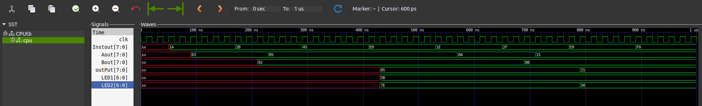

# An 8-bit Von-Neumann MicroComputer in Verilog HDL

This computer is based on the Von Neumann architechture (Same memory shared between program and data).
The VerilogModules folder contains all the Verilog source codes to simulate the 8-bit computer and also the testbench file.
The modules required for the computer are defined separately and then combined and interfaced in a common module named CPU.v .
It also contains a testbench file named CPU_tb.v which is used to simulate the behaviour of the computer.

The parent folder contains the Assembly language compiler in the form of a python script as well as a DemoProgram.asm file which is essentially a 16 byte executable assembly code. The compiler accepts the compilable text file as an argument in the compilation line and writes the binary sequence in a file named binary.txt .

And the outputFiles folder contains the output obtained from the testing of the modules. 

# Using The Assembler

In order to use the assembler, please use below mentioned syntax :

```shell
$ python Assembler_v2.py <input_filename_with_extension>
```

Or,

```shell
$ python3 Assembler_v2.py <input_filename_with_extension>
```

And press Enter.

Now the RAM.v module in the VerilogModules folder will be updated with the new set of instructions.
No need to copy paste anything into the RAM module.

###### THIS METHOD IS RECOMMENDED!!

# System Requirements

- Make sure you have Python3 installed in your system.

- Make sure you have iverilog (abbreviation of Icarus Verilog) or Vivado synthesizer/simulator.

# Recommended Way To Use

- Install iverilog (an open source verilog code synthesizer) from here <https://bleyer.org/icarus/> 

- Make sure you have GTKWave (an waveform analyzer tool) installed in your system.

- Make sure you have the latest version of make (to run the Makefile).
  
  Now, just execute the following commands on cmd (for windows) or terminal (linux or mac):
  
  ```shell
  $ make
  ```
  
  That's it! 
  
  This "make" command will now create and open the waveform for the Verilog module - CPU_tb.v and you will be able to see it in GTKWave.

- If you are on Windows and the Makefile is not working for you, try the following:
  
  - Open the cmd and 'cd' to the directory of the GitHub repository.
  
  - Use the following commands:

```shell
$ cd VerilogModules
$ iverilog CPU_tb.v
$ vvp a.out
$ gtkwave dump.vcd
```

Now the gtkwave program (also an open source waveform viewer) will display the output of the 8bit Computer in a new window.

# Expected Output

A sample output (after running the assembly program from this repository) is shown below:

<div>
</img>
</div>

# THANK YOU !!!
